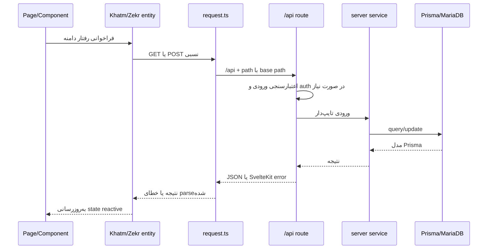
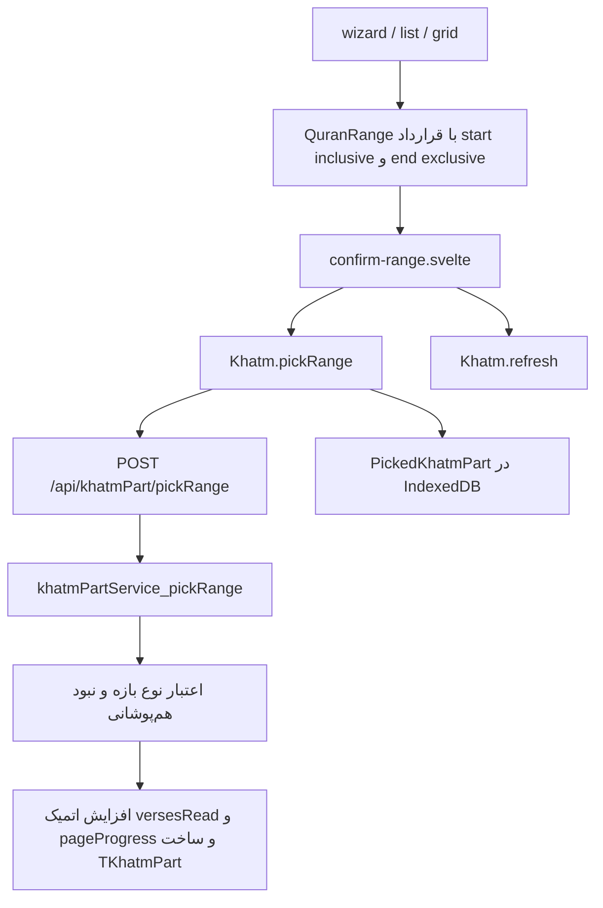
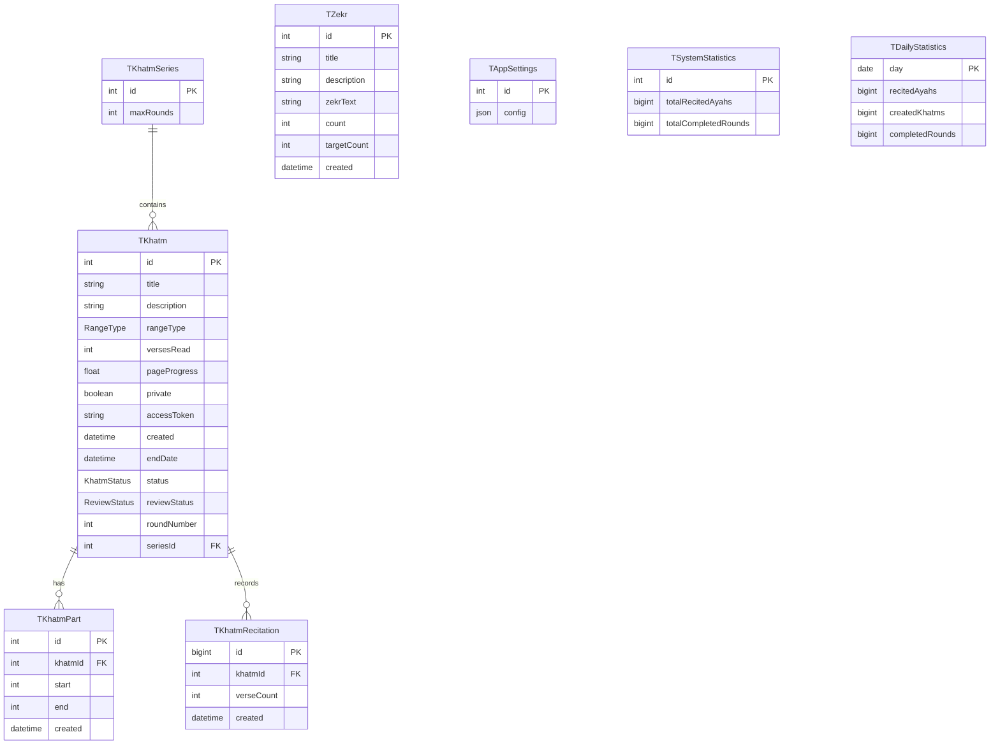

# معماری پروژه Quran Khatm

> این سند یک نقشهٔ مرجع برای فهم معماری کل پروژه است. برای تغییرهای محدود، ابتدا همان فایل‌ها و همسایه‌های مستقیمشان را بررسی کنید و فقط وقتی به شناخت جریان‌های چندلایه، قراردادهای داده یا اثرات جانبی نیاز دارید به این سند مراجعه کنید.

## ۱. هدف و تصویر کلی

این مخزن یک برنامهٔ فارسی و راست‌به‌چپ برای هماهنگی ختم گروهی قرآن و ذکر است. برنامه با SvelteKit و TypeScript نوشته شده، در سرور Node اجرا می‌شود، دادهٔ مشترک را در MariaDB نگه می‌دارد و تاریخچه و تنظیمات شخصی هر مرورگر را در LocalStorage، Cookie و IndexedDB ذخیره می‌کند.

سه سناریوی اصلی دامنه عبارت‌اند از:

- ختم قرآن بازه‌ای: کاربر یک بازهٔ آزاد، سوره، جزء، حزب یا صفحه را انتخاب می‌کند؛ بازه به شکل یک `TKhatmPart` در سرور ثبت می‌شود.
- ختم قرآن آیه‌به‌آیه: کاربر تعداد آیهٔ بعدی را می‌گیرد؛ سرور فقط `versesRead` را به‌صورت ترتیبی جلو می‌برد و متن آیات انتخاب‌شده را برمی‌گرداند.
- ختم ذکر: کاربر تعدادی ذکر را تقبل می‌کند؛ شمارندهٔ مشترک در MariaDB و سهم شخصی او در IndexedDB به‌روز می‌شود.

```mermaid
flowchart LR
    Browser[مرورگر / Svelte 5 UI]
    Routes[SvelteKit pages & layouts]
    API[SvelteKit API routes & form actions]
    Domain[Client domain entities]
    Services[Server services]
    Prisma[Prisma Client + MariaDB adapter]
    DB[(MariaDB)]
    Local[(LocalStorage / Cookie / IndexedDB)]
    Quran[@ghoran packages]
    Eitaa[Eitaa API]
    Fonts[Remote QPC font files]

    Browser --> Routes
    Routes --> Domain
    Domain --> API
    API --> Services
    Services --> Prisma --> DB
    Browser --> Local
    Routes --> Quran
    Services --> Quran
    Services -. notification .-> Eitaa
    Browser -. /api/font .-> API -. cache/proxy .-> Fonts
```

## ۲. فناوری‌ها و تصمیم‌های زیربنایی

| حوزه | انتخاب | نقش |
| --- | --- | --- |
| چارچوب | SvelteKit 2 + Svelte 5 | SSR، routing، form actions، API و رابط reactive مبتنی بر runes |
| زبان | TypeScript strict | قرارداد بین routeها، entityها، سرویس‌ها و Prisma |
| اجرا | `@sveltejs/adapter-node` | تولید سرور Node مستقل |
| پایگاه‌داده | MariaDB | منبع حقیقت ختم‌ها، بازه‌های خوانده‌شده، ذکرها و تنظیمات عمومی |
| ORM | Prisma 7 + `@prisma/adapter-mariadb` | schema، migration و دسترسی تایپ‌دار به MariaDB |
| دادهٔ قرآن | بسته‌های `@ghoran/*` | metadata، entityهای آیه/سوره/جزء/صفحه/حزب، متن و ترجمه |
| ذخیرهٔ مرورگر | Dexie/IndexedDB | تاریخچهٔ ختم ساخته‌شده، بازهٔ انتخاب‌شده و سهم شخصی ذکر |
| تنظیمات مرورگر | LocalStorage + Cookie | تنظیمات کامل در LocalStorage؛ theme و translation موردنیاز SSR در Cookie |
| UI | UnoCSS + سیستم طراحی محلی | utility classها، primitiveهای `ui-*`، پوسته‌ها و RTL |
| آیکون | `unplugin-icons` | import آیکون‌ها با alias مجازی `~icons/...` |
| تست | Vitest + Testing Library + jsdom | workspace جدا برای تست‌های client و server |

## ۳. مرز لایه‌ها و ساختار پوشه‌ها

```text
.
├── prisma/                    # schema و migrationهای MariaDB
├── static/                    # assetهای عمومی و PWA
├── src/
│   ├── lib/
│   │   ├── components/        # UI قابل استفادهٔ مجدد
│   │   │   └── Quran/         # نمایش آیه، صوت و مدیریت فونت قرآن
│   │   ├── entity/            # مدل دامنهٔ سمت UI و تبدیل داده‌ها
│   │   ├── hooks/             # helperهای reactive مبتنی بر runes
│   │   ├── idb/               # schema و repositoryهای IndexedDB
│   │   ├── server/            # کد صرفاً سروری
│   │   │   └── service/       # منطق کسب‌وکار و دسترسی به DB/سرویس بیرونی
│   │   └── utility/           # helperهای کوچک و بدون دامنه یا UI
│   ├── params/                # matcherهای پارامترهای route
│   ├── routes/                # صفحات، layoutها، form actionها و API
│   ├── hooks.server.ts        # bootstrap و pipeline سراسری سرور
│   ├── hooks.client.ts        # bootstrap کلاینت و polyfill
│   └── app.*                  # shell HTML، CSS و type augmentation
└── فایل‌های config            # SvelteKit، Vite، UnoCSS، Prisma، TS و lint
```

قواعد وابستگی فعلی:

1. فایل‌های `src/lib/server/**` فقط از routeهای سروری، hook سرور یا دیگر فایل‌های server import می‌شوند.
2. صفحه‌ها و componentها از کلاس‌های `src/lib/entity/**` برای رفتار دامنه و وضعیت reactive استفاده می‌کنند.
3. entityهای `Khatm`، `Zekr` و `Showcase` با `src/lib/utility/request.ts` به `/api/**` متصل می‌شوند؛ صفحه‌ها معمولاً URLهای API را مستقیم نمی‌سازند.
4. repositoryهای `src/lib/idb/**` فقط تاریخچه و دادهٔ شخصی مرورگر را نگه می‌دارند و منبع حقیقت مشترک نیستند.
5. typeهای تولیدشدهٔ Prisma با importهای type-only در بخشی از کد کلاینت هم استفاده می‌شوند؛ اجرای Prisma فقط در `src/lib/server/**` است.
6. `MultipleAyah.svelte` برای دسترسی اختیاری به ختم جاری مستقیماً `khatm-context.svelte.ts` را از پوشهٔ route import می‌کند. این یک وابستگی معکوس شناخته‌شده از component عمومی به route است و هنگام جابه‌جایی هرکدام باید در نظر گرفته شود.

## ۴. aliasها و قرارداد import

`svelte.config.js` علاوه بر alias استاندارد `$lib` سه alias تعریف می‌کند:

| alias | مقصد | مصرف اصلی |
| --- | --- | --- |
| `$api` | `src/routes/api` | استفاده از type پاسخ API در entityها، مانند `PickAyahResult` |
| `$service` | `src/lib/server/service` | routeهای سروری و importهای type-only مربوط به قرآن |
| `@prisma-client` | `src/lib/server/generated/prisma/client` | typeها، enumها و خطاهای Prisma |

کلاینت Prisma در `src/lib/server/generated/prisma/` تولید می‌شود و فایل تولیدی بخشی از سورس دست‌نویس نیست. `src/lib/index.ts` در حال حاضر export عمومی خاصی ندارد.

## ۵. چرخهٔ راه‌اندازی و request

### راه‌اندازی سرور

1. `src/hooks.server.ts:init`، تابع `appSettingsService_init()` را اجرا می‌کند.
2. `src/lib/server/service/appSettings.ts` رکورد ثابت `TAppSettings(id=1)` را می‌خواند یا می‌سازد، config را در singleton حافظه نگه می‌دارد و ختم‌های showcase را hydrate می‌کند.
3. نخستین import دیتابیس، `src/lib/server/db.ts` را اجرا می‌کند؛ URL اتصال تجزیه و `PrismaMariaDb` ساخته می‌شود. در development یک Prisma client روی `globalThis` reuse می‌شود.
4. `hooks.server.ts:handle` مقدار معتبر Cookie با نام `colorScheme` را هنگام SSR به `data-color-scheme` روی `<html>` تزریق می‌کند.
5. `hooks.server.ts:handleError` در development خطا را log می‌کند و در صورت فعال بودن provider ایتا، خلاصهٔ خطا را به مدیر می‌فرستد.

### راه‌اندازی کلاینت

1. `src/hooks.client.ts`، `src/polyfill.ts` را برای مرورگرهای قدیمی بارگذاری می‌کند.
2. `src/routes/+layout.svelte`، `LocalSettings.provide()` را فراخوانی می‌کند و context تنظیمات را برای کل درخت component می‌سازد.
3. تنظیمات از LocalStorage بازیابی می‌شوند؛ تغییر theme روی `document.documentElement.dataset.theme` اعمال می‌شود.
4. toast، footer و progress bar ناوبری در layout ریشه mount می‌شوند. progress bar به‌صورت dynamic import بارگذاری می‌شود.

### مسیر عمومی داده



## ۶. نقشهٔ routeهای صفحه‌ای

Route group با نام `(khatm)` در URL دیده نمی‌شود. matcherها در `src/params/` معنی پیشوندهای کوتاه را تعیین می‌کنند:

- `k{id}`: ختم بازه‌ای معمولی؛ `ks{seriesId}`: آخرین دور در حال اجرای دنبالهٔ ختم بازه‌ای.
- `a{id}`: ختم آیه‌به‌آیه؛ `as{seriesId}`: آخرین دور در حال اجرای دنبالهٔ آیه‌ای.
- `z{id}`: ختم ذکر.
- `{surah}:{ayah}-{surah}:{ayah}`: بازهٔ معتبر برای نمایش متن آیات.

| URL منطقی | فایل‌ها | مسئولیت و وابستگی مهم |
| --- | --- | --- |
| `/` | `routes/+page.server.ts`, `+page.svelte` | دریافت موازی فهرست ختم عمومی، showcase، ذکرها و آمار تجمیعی هفت‌روزه؛ تبدیل plain data به `Khatm` و `Zekr`؛ نمایش خلاصهٔ تاریخچهٔ محلی |
| `/list` | `routes/list/+page.server.ts`, `+page.svelte` | فهرست صفحه‌بندی‌شدهٔ ختم‌های approved؛ صفحه‌های بعدی از `Khatm.getList()` و API گرفته می‌شوند |
| `/add` | `routes/add/+page.server.ts`, `+page.svelte`, `sucess-result.svelte` | ساخت ختم از form action؛ در صورت سریالی بودن ساخت `TKhatmSeries`؛ notification برای ختم عمومی؛ ذخیرهٔ ختم ساخته‌شده در IndexedDB |
| `/history` | `routes/history/+page.svelte`, `history-khatm.svelte`, `history-picked-range.svelte` | خواندن تاریخچهٔ محلی ختم‌های ساخته‌شده و بازه‌های انتخاب‌شده از Dexie؛ تاریخچهٔ ذکر فعلاً با `history-zekr.svelte` در صفحهٔ اصلی نمایش داده می‌شود |
| `/settings` | `routes/settings/+page.ts`, `+page.svelte`, `Settings*.svelte` | صفحهٔ client-only برای theme، فونت، ترجمه و قاری |
| `/k{id}` و `/ks{seriesId}` | `(khatm)/+layout.server.ts`, `+layout.svelte`, `[normalKhatm]/(wizard)/+page.svelte` | بارگذاری ختم و access token، ایجاد context مشترک، انتخاب مرحله‌ای بازه و نمایش progress |
| `/k{id}/list` و `/ks{seriesId}/list` | `[normalKhatm]/list/+page.svelte` | نمایش سلسله‌مراتبی جزءها و زیر‌بازه‌ها و انتخاب بخش آزاد |
| `/k{id}/grid` و `/ks{seriesId}/grid` | `[normalKhatm]/grid/+page.svelte` | نمایش شبکه‌ای سوره/صفحه/حزب و محاسبهٔ زیر‌بازه‌های آزاد |
| `/k{id}/{range}` | `[range]/+page.server.ts`, `+page@.svelte` | validate بازه، محدودیت تقریبی ۵۰ صفحه، خواندن ترجمه از Cookie و نمایش متن آیات بیرون از layout ختم |
| `/a{id}` و `/as{seriesId}` | `(khatm)/+layout.*`, `[ayahKhatm]/+page.svelte` | دریافت ترتیبی آیات بعدی، تنظیم تعداد، نمایش متن/ترجمه و کنترل صوت |
| `/z{id}` | `[zekr=zekr]/+page.server.ts`, `+page.svelte`, `ZekrActions.svelte` | دریافت ذکر، ثبت تعداد تقبل‌شده و نمایش سهم شخصی از IndexedDB |
| `/admin` | `admin/+layout.server.ts`, `+page.svelte` | حفاظت تمام زیرمسیرها با Basic Auth و نمایش ورودی ابزارهای مدیریت |
| `/admin/review` | `admin/review/+page.svelte` | دریافت فهرست pending/approved/rejected و تغییر `reviewStatus` از API |
| `/admin/showcase` | `admin/showcase/+page.server.ts`, `+page.svelte` | انتخاب حداکثر ۲۰ ختم برای showcase و ذخیره در تنظیمات برنامه |
| `/admin/app-settings` | `admin/app-settings/+page.server.ts`, `+page.svelte` | مدیریت support link، تنظیمات notification و اجرای refresh وضعیت ختم‌ها |
| `/admin/add-zekr` | `admin/add-zekr/+page.server.ts`, `+page.svelte`, `sucess-result.svelte` | ساخت ذکر و ثبت آن به‌عنوان ذکر متعلق به کاربر در IndexedDB همان مرورگر |
| `/manifest.json` | `manifest.json/+server.ts` | manifest پویا و base-path-aware برای PWA |

`src/routes/(khatm)/+layout.server.ts` دو قرارداد امنیتی/مسیری را هم اعمال می‌کند: access token خصوصی از query parameter با نام `t` خوانده می‌شود، و URL سریالی فقط به ختم دارای `seriesId` و در حال اجرا resolve می‌شود. نوع ختم نیز باید با matcher پیشوند `k` یا `a` هم‌خوان باشد.

## ۷. نقشهٔ API

همهٔ endpointهای زیر زیر `/api` هستند و helper کلاینت `request.ts`، `base` تنظیم‌شدهٔ SvelteKit را قبل از آن قرار می‌دهد.

| method و path | route | service/اثر |
| --- | --- | --- |
| `GET /api/khatm` | `api/khatm/+server.ts` | دریافت ختم کامل با parts با `khatmId` و `accessToken` |
| `GET /api/khatm/list` | `api/khatm/list/+server.ts` | فهرست صفحه‌بندی‌شده؛ pending/rejected نیازمند admin، ورودی دیگر به approved محدود می‌شود |
| `POST /api/khatm/update` | `api/khatm/update/+server.ts` | تغییر review status؛ فقط admin |
| `POST /api/khatm/refreshStatus` | `api/khatm/refreshStatus/+server.ts` | اصلاح ختم‌هایی که `versesRead` آن‌ها کامل شده؛ فقط admin |
| `POST /api/khatmPart/pickRange` | `api/khatmPart/pickRange/+server.ts` | validate بازه و ثبت اتمیک `TKhatmPart` بدون overlap |
| `POST /api/khatmPart/pickNext` | `api/khatmPart/pickNext/+server.ts` | تخصیص ۰ تا ۴۰ آیهٔ بعدی برای ختم آیه‌ای و بازگرداندن متن/ترجمه |
| `POST /api/zekr/pick` | `api/zekr/pick/+server.ts` | افزایش شمارندهٔ ذکر، با سقف ۱۰۰۰ در هر request |
| `POST /api/showcase` | `api/showcase/+server.ts` | ذخیرهٔ آرایهٔ شناسه‌های showcase؛ فقط admin |
| `GET /api/font` | `api/font/+server.ts` | proxy و cache درون‌حافظه‌ای فونت صفحه‌ای QPC؛ مشروط به `PUBLIC_FONT_PROXY=1` |

Routeها مسئول parse/validation سطح HTTP، ساخت پاسخ JSON و اجرای auth هستند. queryهای Prisma و قواعد دامنه باید در serviceها باقی بمانند.

## ۸. جریان‌های اصلی دامنه

### ختم بازه‌ای



`QuranRange` ستون فقرات این جریان است. indexها صفرمبنا و بازه‌ها نیمه‌باز `[start, end)` هستند. تبدیل سوره، صفحه، جزء و حزب در فایل‌های `Surah.ts`، `Page.ts`، `Juz.ts` و `HizbQuarter.ts` انجام می‌شود. `KhatmPart.fromList()` بخش‌های مجاور را فقط برای نمایش merge می‌کند؛ رکوردهای اصلی DB تغییر نمی‌کنند.

در سرور شرط Prisma تضمین می‌کند تمام partهای موجود یا پیش از بازهٔ جدید تمام شوند یا پس از آن شروع شوند. اگر update به‌علت رقابت هم‌زمان match نشود، خطای `409` با type برابر `conflict-ranges` برمی‌گردد و UI پس از refresh modal را می‌بندد.

### ختم آیه‌به‌آیه

`[ayahKhatm]/+page.svelte` تعداد درخواستی و تنظیمات ترجمه را به `Khatm.pickNextAyat()` می‌دهد. `khatmPartService_pickNextAyat()` ختم با `rangeType='ayah'` را پیدا می‌کند، تعداد را به آیات باقی‌مانده محدود می‌کند و `versesRead` را با guard رقابتی افزایش می‌دهد. سپس در همان تراکنش `pageProgress` را از مقدار واقعی پس از افزایش به‌روز می‌کند. `quran.ts` بازهٔ تازه تخصیص‌یافته را از JSONهای متن Hafs/QPC و ترجمهٔ انتخابی می‌سازد. در این نوع ختم، `TKhatmPart` ساخته نمی‌شود؛ ترتیب فقط از `versesRead` استخراج می‌شود.

`MultipleAyah.svelte` نمایش مجموعه را هماهنگ می‌کند، `FontManager.svelte.ts` فونت Hafs یا فونت صفحه‌ای QPC را preload می‌کند، `AudioManager.svelte.ts` state صوت را نگه می‌دارد و `SingleAyah.svelte` هر آیه، ترجمه، صوت و لینک متن پیرامونی را render می‌کند.

### ختم سریالی و تکمیل

وقتی کاربر هنگام ساخت ختم گزینهٔ سری را انتخاب کند، `khatmSeries_createForKhatmId()` یک `TKhatmSeries` با شناسهٔ برابر ختم نخست می‌سازد و آن ختم را به سری متصل می‌کند. `khatmService_setAsCompleted()` وضعیت دور جاری و `endDate` را به‌روز می‌کند و، اگر `maxRounds` مانع نباشد، یک `TKhatm` جدید با `roundNumber + 1` و همان `seriesId` می‌سازد. URLهای `ks...` و `as...` همیشه دور در حال اجرای سری را resolve می‌کنند.

### ختم ذکر

`Zekr.pick()` به `/api/zekr/pick` درخواست می‌دهد؛ `zekrService_pick()` شمارندهٔ سراسری را افزایش می‌دهد و entity کلاینت مقدار reactive را جلو می‌برد. سپس `idb_localZekr_increaseMyCount()` سهم شخصی همان مرورگر را ذخیره می‌کند. بنابراین `TZekr.count` حقیقت جمعی و `LocalZekr.myCount` تاریخچهٔ شخصی است.

### review، showcase و notification

ختم عمومی با `reviewStatus='pending'` ساخته می‌شود. فهرست عمومی فقط ختم‌های `approved` و غیرخصوصی را نشان می‌دهد. صفحهٔ review از API مدیریتی برای approve/reject استفاده می‌کند. showcase در JSON تنظیمات `TAppSettings` به شکل آرایهٔ شناسه ذخیره و در singleton سرور به آرایهٔ مدل‌های `TKhatm` hydrate می‌شود؛ خواندن آن الگوی stale-while-revalidate درون‌حافظه‌ای دارد.

برای ختم عمومی تازه، form action ساخت ختم `getNotificationProvider().sendNewKhatm()` را صدا می‌زند. provider با توجه به config ذخیره‌شده یا `EitaaAdminNotification` است یا `NoopAdminNotification`. همین abstraction برای گزارش خطاهای سراسری هم استفاده می‌شود.

## ۹. لایهٔ server و مسئولیت فایل‌ها

| فایل | مسئولیت |
| --- | --- |
| `src/lib/server/db.ts` | ساخت adapter MariaDB، Prisma client و reuse در hot reload |
| `src/lib/server/config.ts` | تبدیل env عمومی proxy فونت به boolean؛ همچنین export فعلی `PRIVATE_KHATM_SECRET` که در کد مصرف‌کننده‌ای ندارد |
| `service/auth.ts` | ساخت مقدار Basic Authorization از `ADMIN_USER`/`ADMIN_PASS` و enforce کردن admin |
| `service/khatm.ts` | query فهرست‌ها، ساخت/دریافت/به‌روزرسانی ختم، سری و تکمیل دور |
| `service/khatmPart.ts` | قواعد انتخاب بازه و آیات بعدی، concurrency guard و تکمیل ختم |
| `service/khatmSeries.ts` | ساخت سری و اتصال ختم نخست |
| `service/zekr.ts` | CRUD محدود ذکر و افزایش شمارنده |
| `service/quran.ts` | map متن‌های سه فونت و ترجمه‌ها به `AyahInfo`؛ بدون query دیتابیس |
| `service/statistics.ts` | افزایش اتمیک آمار کل/روزانه، cache سراسری process و بازسازی lazy آن در شروع process یا تغییر روز تهران |
| `service/appSettings.ts` | singleton config، persistence رکورد `id=1`، showcase و setterهای تنظیمات |
| `service/admin-notification/*` | interface ارسال، provider ایتا و fallback بدون‌عملیات |

## ۱۰. entityهای کلاینت و ارتباط آن‌ها

| فایل | ورودی/وابستگی | خروجی/مصرف |
| --- | --- | --- |
| `Khatm.svelte.ts` | plain `TKhatm`، `request.ts` و `PickedKhatmPart` | state reactive ختم، URL، progress صفحه‌محور ذخیره‌شده، share/copy، refresh، review و انتخاب بازه/آیه |
| `Zekr.svelte.ts` | plain `TZekr`، API و repository ذکر محلی | state reactive ذکر، progress، share/copy و pick |
| `Range.ts` | entityهای `@ghoran` و helperهای تبدیل | parse/serialize URL، عنوان، تقسیم، درصد پوشش و تطبیق `RangeType` |
| `KhatmPart.ts` | plain `TKhatmPart` | wrapper نمایشی و merge بخش‌های مجاور |
| `PickedKhatmPart.ts` | repository Dexie و `QuranRange`/`Khatm` | مدل تاریخچهٔ بازه‌های انتخاب‌شده |
| `CreatedKhatm.ts` | repository Dexie و `Khatm` | مدل تاریخچهٔ ختم‌های ساخته‌شده |
| `LocalSettings.svelte.ts` | LocalStorage، Cookie و Svelte context | config reactive و `SettingsEditor` تراکنشی/زنده |
| `Ayah.ts` | entity آیه و reciter | URL صوت و لینک بیرونی |
| `Surah.ts`, `Page.ts`, `Juz.ts`, `HizbQuarter.ts` | entity متناظر از `@ghoran/entity` | تبدیل به `QuranRange` و عنوان فارسی |
| `Showcase.ts` | `request.ts` | facade کوچک ذخیرهٔ showcase برای صفحهٔ admin |
| `Theme.ts` | دادهٔ ثابت | فهرست و type حالت‌های رنگ سیستم، روشن و تاریک |

`Khatm.fromPlain()` و `Zekr.fromPlain()` در مرورگر cache سراسری بر اساس id دارند تا componentهای مختلف به یک instance reactive برسند. دادهٔ ختم وقتی `versesRead` یا `pageProgress` جدیدتر باشد، یا وضعیت کامل تازه‌ای برسد، جایگزین می‌شود؛ برای parts ختم، طول بیشتر نیز باعث refresh آرایه می‌شود. در SSR cache استفاده نمی‌شود.

## ۱۱. persistence و مدل داده



نکات مدل Prisma در `prisma/schema.prisma`:

- `RangeType`: `free`, `juz`, `hizbQuarter`, `page`, `surah`, `ayah`.
- `KhatmStatus`: `inProgress`, `completed`.
- `ReviewStatus`: `pending`, `approved`, `rejected` و index روی `TKhatm.reviewStatus`.
- `TKhatmPart.start/end` و `TKhatm.versesRead` از عددهای unsigned مناسب دامنهٔ ۶۲۳۶ آیه استفاده می‌کنند. `TKhatm.pageProgress` درصد ۰ تا ۱۰۰ صفحه‌محور را برای خواندن مستقیم در فهرست‌ها نگه می‌دارد.
- وزن هر آیه معکوس تعداد آیات صفحهٔ مصحف آن است. انتخاب بازه و انتخاب ترتیبی آیات، `pageProgress` را همراه `versesRead` در یک تراکنش به‌روز می‌کنند و migration داده‌های قدیمی را از partها یا بازهٔ ترتیبی backfill می‌کند.
- `TAppSettings` عملاً singleton با `id=1` است و config ساختار support/showcase/notification دارد.
- `TSystemStatistics(id=1)` و `TDailyStatistics(day)` شمارنده‌های ازپیش‌تجمیع‌شده‌اند؛ دیتابیس منبع حقیقت است و cache روی `globalThis` پس از commit به‌صورت write-through به‌روز می‌شود.
- migrationهای timestamped در `prisma/migrations/` تاریخچهٔ افزودن بسم‌الله، app settings، ذکر، سری ختم و review status را نگه می‌دارند.

### داده‌های مرورگر

| storage | key/table | محتوا | نویسنده/خواننده |
| --- | --- | --- | --- |
| LocalStorage | `app_v1_localSettings` | تنظیمات شخصی کامل | `LocalSettings` و `localStore.ts` |
| Cookie | `colorScheme` | پوستهٔ دستی لازم برای SSR بدون flash | `LocalSettings` → `hooks.server.ts` |
| Cookie | `translation` | ترجمهٔ لازم برای server load نمایش بازه | `LocalSettings` → `[range]/+page.server.ts` |
| IndexedDB `Khatm` | `pickedKhatmParts` | snapshot ختم، بازه و زمان انتخاب | `Khatm.pickRange()` و صفحات history |
| IndexedDB `Khatm` | `createdKhatms` | snapshot ختم ساخته‌شده | نتیجهٔ `/add` و history |
| IndexedDB `Khatm` | `localZekr` | snapshot ذکر، مالکیت و `myCount` | ساخت/انتخاب ذکر و history |

repositoryهای Dexie فیلدهای snapshot، از جمله `pageProgress`، را صریح کپی می‌کنند تا داده‌های سنگین یا رابطه‌های ناخواسته وارد IndexedDB نشوند. snapshotهای قدیمی فاقد این فیلد هنگام ساخت entity با مقدار صفر normalize می‌شوند و چون index جدیدی لازم نیست، نسخهٔ schema افزایش نمی‌یابد.

## ۱۲. componentها و UI مشترک

| component/file | نقش و مصرف‌کنندهٔ اصلی |
| --- | --- |
| `Header.svelte` | header با back navigation و snippet انتهایی در اغلب صفحه‌ها |
| `TheFooter.svelte` | لینک پشتیبانی و GitHub از دادهٔ layout ریشه |
| `TheToast.svelte` | API singleton toast و host سراسری |
| `TheBProgress.svelte` | اتصال BProgress به before/after navigation |
| `Modal.svelte` | modal مبتنی بر snippet برای انتخاب بازه، تنظیمات و شمارندهٔ ذکر |
| `Tab.svelte` | tabهای layout ختم و صفحات admin |
| `Accardeon.svelte` | نمایش سلسله‌مراتبی فهرست ختم |
| `ExpandableText.svelte` | خلاصه/گسترش توضیحات طولانی |
| `ThemeButton.svelte` | اعمال theme از طریق context تنظیمات |
| `Quran/MultipleAyah.svelte` | orchestration فونت، صوت و لیست آیات |
| `Quran/SingleAyah.svelte` | render متن، ترجمه، اطلاعات سوره و کنترل صوت یک آیه |
| `Quran/FontManager.svelte.ts` | strategy فونت Hafs/QPC و preload صفحهٔ بعد |
| `Quran/AudioManager.svelte.ts` | state مشترک HTMLAudioElement و حرکت به آیهٔ بعد |

`src/lib/hooks/watch.svelte.ts` دو helper به نام‌های `watch` و `watchEager` روی `$effect` و `untrack` می‌سازد. utilityهای مهم دیگر `request.ts` برای قرارداد HTTP، `path.ts` برای URLهای base-aware، `splitIntervals.ts` برای تقسیم بازه و `findNonOverlappingSubranges.ts` برای پیدا کردن قسمت‌های آزاد هستند.

## ۱۳. فایل‌های config، build و asset

| فایل | اثر معماری |
| --- | --- |
| `package.json` | scriptها، نسخهٔ pnpm 10 و تفکیک dependencyهای runtime/dev |
| `svelte.config.js` | adapter-node، aliasها، `BASE_PATH` و URLهای non-relative |
| `vite.config.ts` | SvelteKit/UnoCSS/icons، target مرورگر و دو workspace تست client/server |
| `uno.config.ts` | Wind3، legacy compatibility و transformerها |
| `postcss.config.js` | preset-env با غیرفعال‌بودن تبدیل logical properties |
| `tsconfig.json` | strict mode، bundler resolution، JSON و type آیکون‌های Svelte 5 |
| `prisma.config.ts` | مسیر schema/migration و ترجیح `DIRECT_DATABASE_URL` برای CLI در صورت وجود |
| `src/app.html` | shell فارسی RTL، manifest، viewport و preload داده روی hover |
| `src/app.css` | ورودی فونت و سیستم طراحی محلی؛ توکن‌ها، اجزا و layout در `src/lib/styles/` |
| `src/app.d.ts` | توسعهٔ `App.Error` با type دامنه‌ای `conflict-ranges` |
| `static/*` | favicon، hero، iconهای PWA و robots.txt |

متغیرهای محیطی مهم:

| متغیر | مصرف |
| --- | --- |
| `DATABASE_URL` | اتصال runtime در `db.ts` و fallback ابزار Prisma |
| `DIRECT_DATABASE_URL` | اتصال مستقیم اختیاری فقط در `prisma.config.ts` |
| `ADMIN_USER`, `ADMIN_PASS` | Basic Auth مدیریت؛ نبودن هرکدام مقدار تصادفی و غیرقابل حدس می‌سازد |
| `PUBLIC_FONT_PROXY` | فعال‌سازی endpoint فونت QPC و گزینه‌های UI مرتبط |
| `BASE_PATH` | prefix استقرار از `svelte.config.js` |
| `ORIGIN` | تنظیم origin runtime adapter/SvelteKit در استقرار |
| `PRIVATE_KHATM_SECRET` | در `config.ts` export می‌شود اما در معماری فعلی مصرف نمی‌شود |

## ۱۴. تست‌ها و پوشش فعلی

- `src/lib/utility/overlapping.test.ts` رفتار `findNonOverlappingSubranges()` را پوشش می‌دهد.
- `src/routes/page.svelte.test.ts` یک smoke test رندر صفحهٔ اصلی است.
- `src/demo.spec.ts` تست نمونهٔ جمع است.
- `vitest-setup-client.ts`، `matchMedia` را برای jsdom mock می‌کند.

پوشش خودکار فعلی برای serviceهای دیتابیس، APIها، رقابت انتخاب بازه، سری ختم، IndexedDB و جریان‌های UI محدود است؛ هنگام تغییر این بخش‌ها باید اثر چندلایه به‌صورت دستی هم بررسی شود.

## ۱۵. نقشهٔ اثر تغییرات

| اگر این موضوع تغییر کند | فایل‌های اصلی | وابستگی‌هایی که باید هم‌زمان بررسی شوند |
| --- | --- | --- |
| شکل URL ختم | `params/*.ts`, `Khatm.getLink()` | `(khatm)/+layout.server.ts`، لینک range، meta URL و history |
| نوع جدید بازه | Prisma `RangeType`, `Range.ts` | فرم `/add`، wizard/grid/list، validation سرویس و migration |
| منطق انتخاب بازه | `khatmPart.ts` | `pickRange` API، `Khatm.pickRange()`، `confirm-range.svelte` و utilityهای overlap |
| محاسبهٔ پیشرفت | `Khatm.svelte.ts` | layout ختم، `TKhatm.versesRead` و رفتار تکمیل/سری |
| متن/ترجمهٔ قرآن | `service/quran.ts` | type `AyahInfo`، `pickNext`، range server load و componentهای Quran |
| فونت قرآن | `FontManager.svelte.ts` | `/api/font`، `PUBLIC_FONT_PROXY`، settings و CSP/شبکهٔ استقرار |
| تنظیمات شخصی | `LocalSettings.svelte.ts` | settings UI، root layout، Cookieهای SSR و migration دادهٔ LocalStorage |
| schema دیتابیس | `prisma/schema.prisma` | migration جدید، serviceها، snapshotهای Dexie و typeهای تولیدی |
| تنظیمات عمومی | `appSettings.ts` | `TAppSettings.config`، admin form، root layout و notification provider |
| احراز هویت مدیر | `auth.ts` | admin layout و تمام endpointهای مدیریتی |
| تاریخچهٔ محلی | `idb/idb.ts` | افزایش نسخهٔ Dexie، repository مربوط و componentهای history |
| base path استقرار | `svelte.config.js` | `request.ts`، `path.ts`، manifest، asset/font URLها و لینک‌های route |

## ۱۶. قراردادهای مهم برای توسعه

1. بازه‌های قرآن را همیشه `[start, end)` در نظر بگیرید؛ تبدیل به آیهٔ آخر فقط در مرز نمایش/URL انجام شود.
2. access token ختم خصوصی در لینک عمومی با query key کوتاه `t` است، اما APIها فیلد `accessToken` دریافت می‌کنند.
3. `versesRead` و `pageProgress` باید با partهای ثبت‌شده یا تخصیص ترتیبی هماهنگ بمانند؛ تغییر مستقیم هرکدام می‌تواند progress، مرتب‌سازی و تکمیل سری را ناسازگار کند.
4. endpointهای مدیریتی باید علاوه بر layout مدیریتی، خودشان `auth_ensureIsAdmin()` را اجرا کنند؛ layout از فراخوانی مستقیم API محافظت نمی‌کند.
5. config در `appSettings_store` و cache آمار صفحهٔ اصلی حافظهٔ process هستند. در استقرار چند process، update یک process فوراً singleton process دیگر را تغییر نمی‌دهد؛ منبع پایدار همچنان DB است.
6. cache فونت، app settings و آمار تجمیعی درون‌حافظه‌ای و وابسته به process هستند؛ IndexedDB و LocalStorage وابسته به مرورگر و origin هستند.
7. snapshotهای Dexie ممکن است از رکورد جاری سرور قدیمی‌تر باشند و برای history طراحی شده‌اند، نه جایگزینی دادهٔ live.
8. هنگام اضافه‌کردن فیلد اجباری به مدل Prisma، کپی صریح همان مدل در repositoryهای IDB را نیز بازبینی کنید.
9. کد server-only نباید از مسیر اجرای مرورگر import شود. import type از `$service/quran` و `@prisma-client` باید type-only باقی بماند.
10. این سند را فقط وقتی یک تغییر معماری، route، مدل داده، جریان بین‌لایه‌ای یا قرارداد مهم را عوض می‌کند به‌روز کنید؛ تغییرهای صرفاً ظاهری یا محلی نیازمند بازنویسی سند نیستند.

## ۱۷. احراز هویت اختیاری و مالکیت ختم

ورود کاربران با Better Auth و Prisma انجام می‌شود. `hooks.server.ts` نشست Cookie-based را برای هر
درخواست می‌خواند و `session` و `user` را در `App.Locals` قرار می‌دهد؛ با این حال تمام مسیرهای عمومی
ساخت، مشاهده و مشارکت همچنان برای مهمان قابل استفاده‌اند. Basic Auth مدیریت مستقل است، از نشست
کاربران استفاده نمی‌کند و علاوه بر زیرمسیر مدیریت، در routeهای مشترک جزئیات و ویرایش نیز می‌تواند
نقش مدیر را احراز کند. query marker برابر `admin=1` فقط challenge احراز هویت را فعال می‌کند و بدون
Basic Auth صحیح هیچ دسترسی مدیریتی اعطا نمی‌کند.

مدل‌های `User`، `Session`، `Account` و `Verification` داده‌های Better Auth را نگه می‌دارند. ورود
ایمیل/رمز، تأیید ایمیل، بازیابی رمز و Google OAuth زیر `/api/auth/*` مدیریت می‌شوند. plugin اختصاصی
ایتا endpoint برابر `/api/auth/sign-in/eitaa` را فراهم می‌کند و `initData` را با HMAC-SHA256، مقایسه
ثابت‌زمان و حداکثر عمر ۶۰ ثانیه اعتبارسنجی می‌کند. حساب ایتا فقط با شناسه provider متصل می‌شود و بر
اساس نام یا ایمیل ساختگی داخلی با حساب دیگری ادغام نمی‌شود.

`TKhatm.ownerId` مالک اختیاری ختم است و تمام actionهای ویرایش و حذف، actor نقش‌محور مالک یا مدیر را
دوباره در service سرور کنترل می‌کنند. مدیر می‌تواند ختم عمومی، خصوصی یا بدون مالک را مدیریت کند و
در جزئیات خصوصی از شرط access token عبور می‌کند؛ سایر درخواست‌ها همچنان به توکن نیاز دارند.
`ownerId` و `guestClaimTokenHash` با نوع `KhatmData` از DTOهای مرورگر حذف می‌شوند. صفحه `/account`
آخرین دور هر دنباله را نمایش می‌دهد و صفحه
`/account/khatms/[id]/edit` فقط دور جاری را قابل ویرایش می‌داند؛ دورهای تاریخی پایان‌یافته ثابت
می‌مانند. تغییر دسترسی روی همه دورهای سری اعمال می‌شود و توقف سری، `maxRounds` را روی دور جاری
قرار می‌دهد.

برای ختم مهمان، سرور یک راز تصادفی می‌سازد، فقط SHA-256 آن را در MariaDB و مقدار خام را در جدول
`createdKhatms` در IndexedDB نگه می‌دارد. پس از ورود، کلاینت claimها را به `/api/khatm/claim`
می‌فرستد؛ update اتمیک فقط رکورد بدون مالک و دارای هش یکسان را منتقل می‌کند و سپس فقط توکن‌های
پذیرفته‌شده از IndexedDB پاک می‌شوند. دور بعدی یک دنباله، مالک یا هش claim دور جاری را به ارث
می‌برد.

حذف مالک یا مدیر، تمام دورها و `TKhatmPart`های وابسته را در یک تراکنش پاک می‌کند. جدول
`TKhatmDeletion`، `khatmId`، `seriesId`، علت حذف و `deletedAt` را به‌عنوان tombstone نگه می‌دارد تا
لینک حذف‌شده پاسخ و پیام `410 Gone` متناسب با حذف مالک، مدیر یا پاک‌سازی خودکار بگیرد، در حالی که
شناسه‌ای که هیچ‌گاه وجود نداشته همچنان `404` است.

متغیرهای محیطی این جریان عبارت‌اند از `BETTER_AUTH_SECRET`، `BETTER_AUTH_URL`،
`GOOGLE_CLIENT_ID`، `GOOGLE_CLIENT_SECRET`، `EITAA_APP_TOKEN` و تنظیمات `SMTP_*`.
